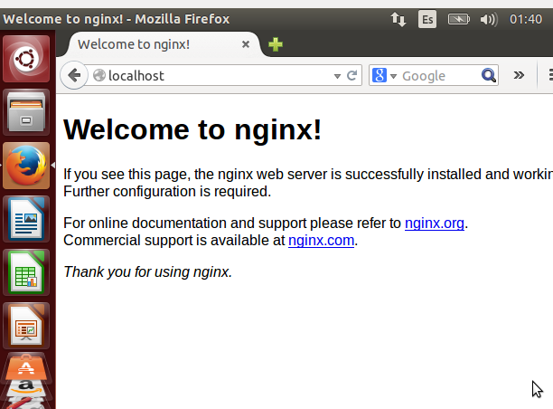

# ServidorWebNginx

## Introducción 

NGINX es un servidor web open source de alta performance que ofrece el contenido estático de un sitio web de forma rápida y fácil de configurar. Ofrece recursos de equilibrio de carga, proxy inverso y streaming, además de gestionar miles de conexiones simultáneas.

Las solicitudes web en otros servidores, como Apache, funcionan de forma individual, es decir, el usuario solicita una página a través del protocolo HTTP o HTTPS, que procesa y devuelve el resultado.

Este proceso es llamado de un thread individual, que se realiza para cada solicitud solicitada desde el servidor.

NGINX funciona con base en eventos. Entonces, en lugar de hacer una solicitud directa al servidor, él ejecuta un proceso maestro, llamado worker, y varios procesos de trabajo, llamados conexiones worker. Todo este proceso funciona de forma continua y asincrónica.

**Para la tarea se han usado dos páginas de https://onehtmlpagechallenge.com/**

Una es building, otra birthday-cake.

---

## Instalación Windows

Primera instalacion en windows. 

Recursos: http://nginx.org/en/docs/windows.html

Una vez instalado movemos la descarga a _Archivos del progama_ 

Pulsamos sobre _nginx.exe_ y comprobamos que funciona correctamente introduciendo _localhost_ en el buscador.

Para ver nuestra version.

Ahora tenemos que activar la caracteristica de _Consola de administracion de IIS_

Creamos una carpeta _C:\Work_ y la asignamos.

Ahora desde _nginx.conf_ podemos editar el fichero introduciendo un dominio.

---

## Instalación y funcionamiento en Linux

Se ha virtualizado un ubuntu 14.04 para la tarea.

Recursos: https://old-releases.ubuntu.com/releases/14.04.4/

Ahora instalamos nginx con el clasico _apt install_

Nos movemos a los siguientes directorios y creamos lo que sera el dominio.

Nos movemos al fichero con un nano e incluimos el dominio.

Después copiamos en un fichero html una de las dos paginas.

Vamos a un fichero llamado host para incluir la ip y el dominio.

Una vez hecho comprobamos las dos paginas como resultado.

